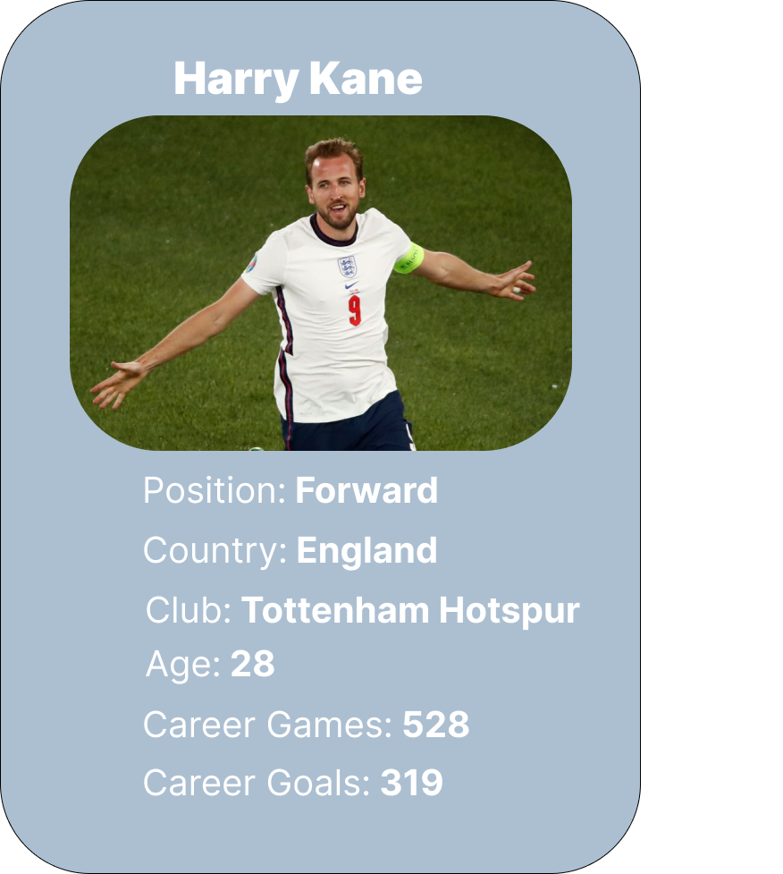
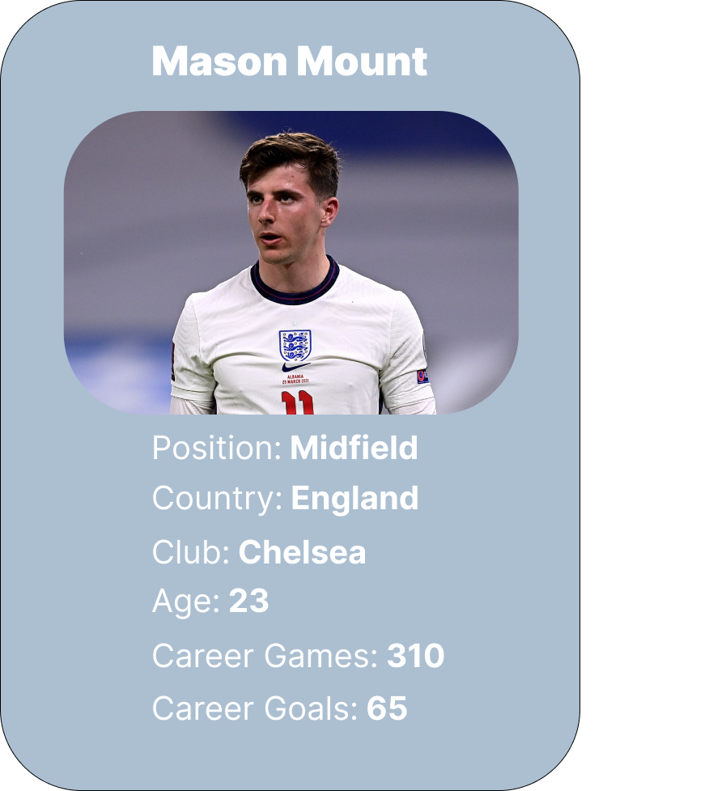
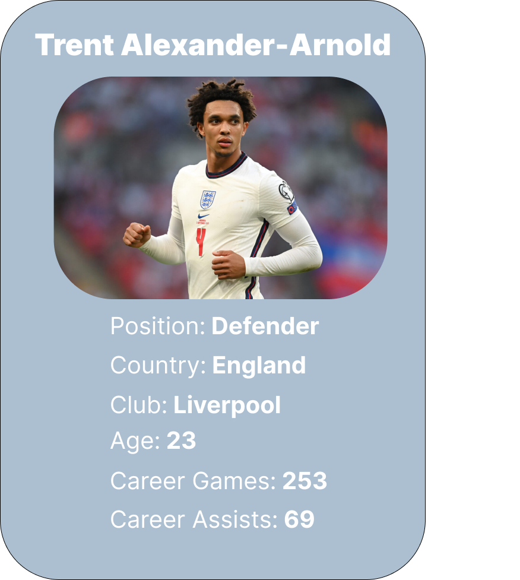
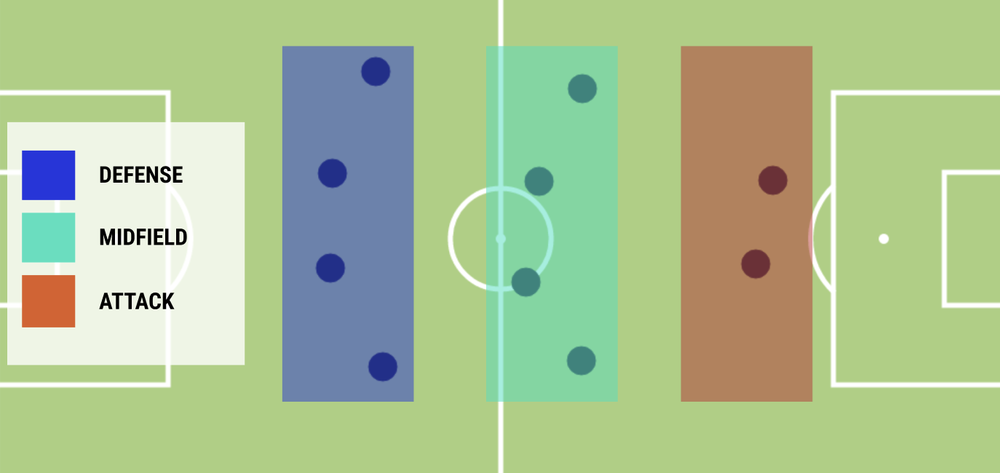
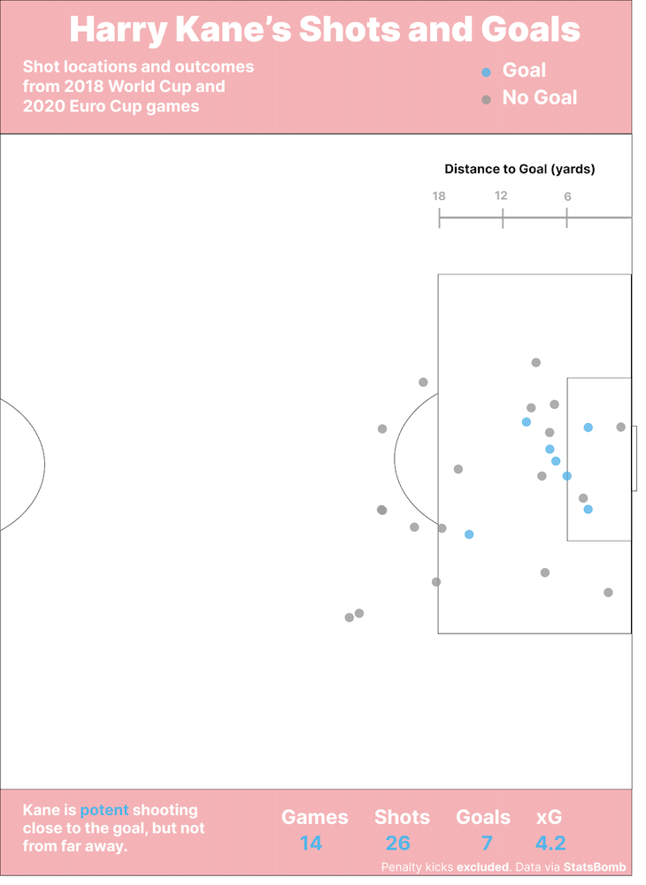
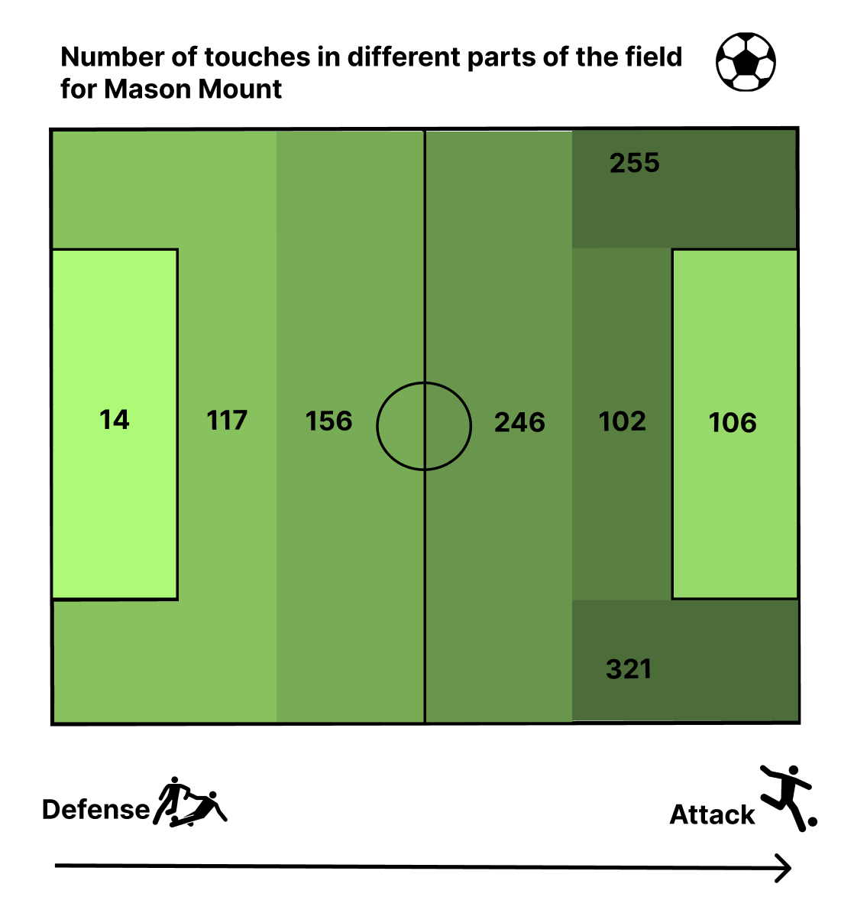
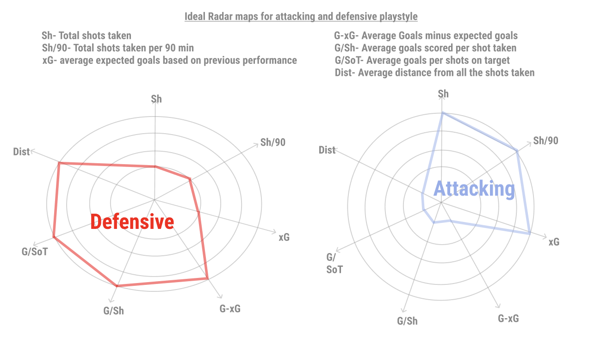
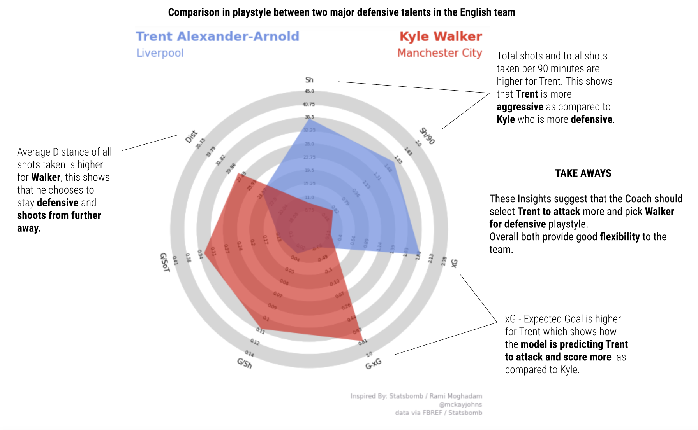

<title>Footy Viz</title>
<body>
	

		

			<h3>Introduction</h3>
		

	

	

		

			
Although the English men's soccer team is one of the oldest national teams in the world, they’ve only won a single major tournament: the 1966 World Cup.

			
Can they win this year's 2022 World Cup?

			
In international soccer, teams don't have very much time to practice together, so the abilities of individuals often ends up deciding games. For this reason, we want to explore the statistics and performances of 3 key players. Their performance in the World Cup, we believe, hinges on the performances of these players.

		

	

	

		

			

				
			

			

				
			

			

				
			

		

	

	 
	 
	

	

		

			<h3>Primer</h3>
		

		

			<h4>How are soccer teams structured?</h4>
		

	

	

		

			
Before cracking into these key players, it's important to review some of the basics of the game of soccer and the types of tournaments teams compete in.

			
For those already familiar with soccer, feel free to skip ahead to the <a href="#tactics">Tactics</a> section.

			
Each team has 11 players. There are two 45 minute halves. The purpose of the game is to score goals against the opposition. Whoever has the most goals at the end of the game wins. It's illegal to use your hands, of course -- which is why most other countries refer to the game as "football."

			
Besides the goalkeeper, players fall into 3 broad categories. <i>Forwards</i> are the goal scorers who are the best at shooting and scoring goals. <i>Defenders</i> protect their goal and try to stop opposition forwards from advancing. <i>Midfielders</i> occupy the middle of the field and try to link together the work from their team's defense and make opportunities for the forwards to score.

			
Each country organizes its soccer teams into a system of "leagues" similar to the NFL. For example, in England their top soccer league is the "Premier League" and in Germany it is the "Bundesliga." Within those leagues, the teams are typically referred to as <i>clubs</i>.

			
The best players from across the world receive the honor to play for their country of origin's <i>national team</i>. The dynamics of each national team are fascinating, then, because players whose "day-jobs" are quite different from one another have to coalesce in short stints of "international breaks" throughout the club soccer season.

			
Winning the World Cup is the crown jewel for national teams. It's played every 4 years, and is the most-watched and most-prestigious sporting event in the world.
 
			
Besides the World Cup, another major tournament England competes in is the European Cup ("The Euros") which is also played every 4 years.

			
To get a better sense of what a soccer team looks lke in action, we're going to introduce a standard "tactics" boards and few videos from matches.

		

	

	 
	 
	

	

		

			<h3>Structure and Formation</h3>
		

		

			<h4>What does a game of soccer look like?</h4>
		

		 
	

	

		

			
This graphic segments the field into defenders, midfielders, and forwards. It should be noted that this only represents what a single team of 11 players looks like -- we haven't included an opposition.

			
To put these groups into clearer context, we'll take a look at screenshots from game footage alongside a highlighted version that points out each of the positions.

		

	

	 
	

		
	

	 
	

		

			
Below is from a club match in Germany. The team in blue, Hoffenheim, is trying to advance the ball upfield (to the right). 3 defenders are supported by a large group of 5 midfielders along with the 2 forwards (only one of which is visible from this perspective).

		

	

	 
	

		

			

				
			

			

				
			

		
	
	

	 
	

		

			
Below is from a club match in England. The team in blue, Manchester City, is trying to advance the ball upfield (to the right). 4 defenders are supported by group of 4 midfielders along with the 2 forwards. This zoomed out perspective makes it easy to see how the positions of players can lead to different styles of gameplay.

		

	

	 
	

		

			

				
			

			

				
			

		
	
	

	 
	

		

			
It's common to classify the way that teams arrange their players into a <i>lineup</i>. These clips show different strategies, with Manchester City adopting something like a "4-5-1" and Hoffenheim adopting a "3-5-2." To interpret these labels, you read from left to right with the left most number representing the number of defenders. For instance, Manchester City used <b>4</b> defenders, <b>5</b> midfielders, and <b>1</b> forward.
 
			
The choice of lineup is quite important because it implicates which players will be selected; you cannot have a team with 11 defenders running around. For national teams like England, the problem is magnified because every player is phenomenal. So, before exploring the strengths of our key players, we want to consider the best lineup choice for England.

		

	

	

	 
	 
	

		

			<h3>Tactics</h3>
		

		

			<h4>What's England's best strategy?</h4>
		

	

	

		

			
Recently, England have excelled in international tournaments, finishing in 3rd place in the 2018 World Cup and losing in the finals of the 2020 Euro Cup.

			
But what will it take to push them to become champions?

			
Let's compare the players England selected for the 2020 Euro Cup Final against Italy to the lineup that our group thinks would give them the best chance of winning!

			
<b>Click between formations</b> to see how we think England should play. Along the way, pay attention to the roles of our 3 key players (Kane, Mount and Alexander-Arnold) which have been highlighted.

		

	

	

		

			

				<h4 style = "color:#EA1F29">3-4-2-1</h4>
				
England's usual lineup.

				<input type="image" src="https://raw.githubusercontent.com/timschott/footy-viz/main/extra/3-4-2-1.png" style="opacity: 0.6;" onclick="default_lineup()"  onmouseout="this.style.opacity=0.6;" onmouseover="this.style.opacity=1;" class="img-fluid">
			

			

				<h4 style = "color:#2B57AC">4-2-3-1</h4>
				
How England <i>should</i> play.

				<input type="image" src="https://raw.githubusercontent.com/timschott/footy-viz/main/extra/4-2-3-1.png" style="opacity: 0.6;" onclick="new_lineup()"  onmouseout="this.style.opacity=0.6;" onmouseover="this.style.opacity=1;" class="img-fluid">
			

		
	
	

	

		<h4>3-4-2-1</h4>
		
England's usual formation, which lost them the Euro 2020 Finals match. England scored a goal 2 minutes after kickoff, but managed just 1 shot on target the rest of the match. Trent-Alexander Arnold did not play, while Mason Mount and Harry Kane (highlighted in red) performed poorly. This formation is relatively conservative, especially given the players England used. They fielded a team with 5 defenders instead of the usual 4. Their outside defenders (Shaw and Trippier) were tasked with shutting down wide options for Italy. This left England with scant attacking options.

	

	

	

	 
	 
	

		

			
Now that we've established the structure of soccer teams in general and recommended a starting lineup for England, let's detail our key players and why we believe their presence is a critical factor for England's success.

		

	

	

	 
	 
	

		

			<h3>Harry Kane (Forward)</h3>
		

		

			<h4>Just how good is England's star striker?</h4>
		

	

	

		

			
Harry Kane boasts an impressive career for both club and country. At just 28 years of age he has already climbed England's goal-scoring ranks, boasting the third most goals in history for their national team.

			
His playing style can be described as the perfect mixture of pragmatism and athleticism. His large frame lets him excel in aerial duels, yet his excellent footwork and great passing ability allows him to easily incorporate his teammates into attacking plays. He is far and away England's most important player. 

			
Let's take a look at Kane's international goal scoring.

		

	

	 
	 
	

	

	 
	 
	

		

			
Kane has scored more goals than any player in the world over the past 2 major competitions. He is well on his way to breaking England's all-time scoring record as well. For some in-depth analysis, let's take a look at where on the field he most effectively shoots from.

		

	

	 
	 
	

		
	

	

	 
	 
	

		

			<h3>Mason Mount (Midfielder)</h3>
		

		

			<h4>What are Mount's best attributes?</h4>
		

	

	

		

			
Mason Mount is a young attacking midfielder who has been impressive in the club tournaments for Chelsea and made quite an impact in the 2020 Euros. As a midfielder, he is responsible for attacking as well getting back on defense and helping his team win the ball back.

			
Considering this, his performance in these two international tournaments was brilliant.

			
Lets explore he touches the ball and where he passes the ball -- two important components of a midfielder's job description.

		

	

	

		

			<h4>Where does Mount touch the ball?</h4>
		

	 
	 
	

	

		

	

	 
	 
	

		

			
Mount touched the ball in all parts of the field, mostly past the halfway line. Mount is especially proactive in the <i>attacking third</i>, the third of the field closest to the oppositions goal. He had the most number of touches on the wide areas to the right and left of the goal (255 and 321 respectively).
 
			
What makes him effective from these positions is that he can then play in passes for strikers like Harry Kane to score goals.

		

	

	 
	 
	

		

			<h4>Where does Mount pass the ball?</h4>
		

	

	 
	

		
	

	 
	

		

			
This graphic visualizes the position of the ball and the direction of the pass. All of these passes have end positions in the attacking third. The cluster in the wing positions illustrate how much he likes to create plays in those positions and then eventually slide in passes in the center.

			
Going forward, England would do well to utilize his creativity by continuing to entrust him with the responsibility of creating scoring chances for strikers like Kane. Plus, as he continues to develop and gain experience, he'll also improve as a shooter and start to score goals of his own.

		

	

	

	 
	 
	

		

			<h3>Trent Alexander-Arnold (Defender)</h3>
		

		

			<h4>What are Trent's strengths?</h4>
		

	

	 
	

		

			
Trent is an up-and-coming defender who has consistently been performing very well in the local leagues but hasn't played a lot in England's international games. We feel his presence would make a big difference in helping Mount and Kane win games.
 
			
Let us look at some ideal attacking and defensive radar charts so we can get a good baseline understanding of different play styles and the abilities Trent offers.

		

	

	 
	 
	

		
	

	 
	

		

			
Let us now contrast these shapes to how Trent compares to other talented defenders currently in England's International team such as Kyle Walker. This comparison reveals how different players playing in the same position can have completely different playstyles.

		

	

	 
	

		
	

	 
	

		

			
By imposing Trent and Kyle's play style against the ideal attacking and defensive charts above, you can see how Trent is more suited towards an attacking play style while Kyle who is more defensive.

			
This data lays a strong argument that <b>Trent's</b> attacking play style will link very well with <b>Mount</b> and <b>Kane</b> to make England an aggressive goal scoring machine. We argue that such a combination can become a World Cup winning strategy given how well all three players are currently performing.

		

	

	 
	 
	

		

			<h3>Summary</h3>
		

	

	

		

			
These three players playing key roles in attack, midfield and defence can make the difference for England to bring the cup home this year. If you would like to learn more about the data we have used, please refer to <a href="https://statsbomb.com/what-we-do/soccer-data/">StatsbombR</a> and <a href ="https://fbref.com/en/">fbref.com</a> which offer excellent interfaces and APIs for working with soccer data.

		

	

</body>
<footer class="site-footer">
	<a href="https://github.com/timschott/footy-viz">footy-viz</a> is maintained by <a href="https://github.com/timschott">timschott</a>.
	This page was generated by <a href="https://pages.github.com">GitHub Pages</a>.
</footer>
